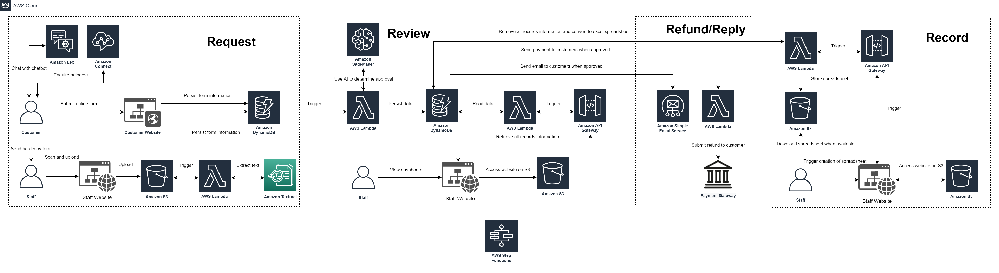
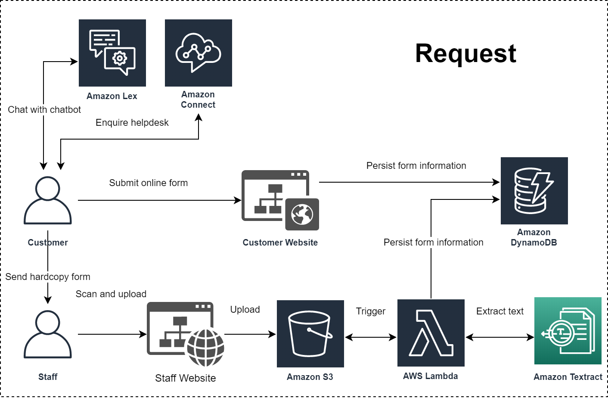
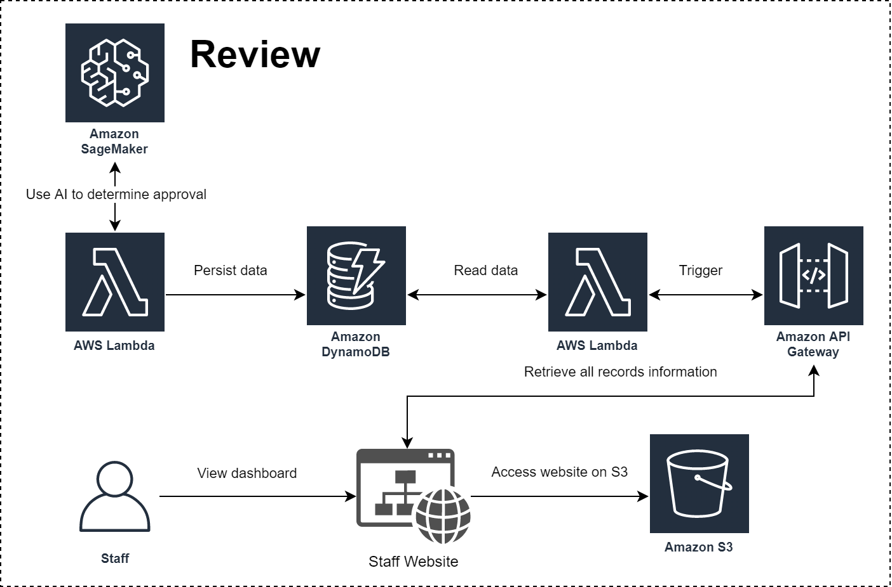
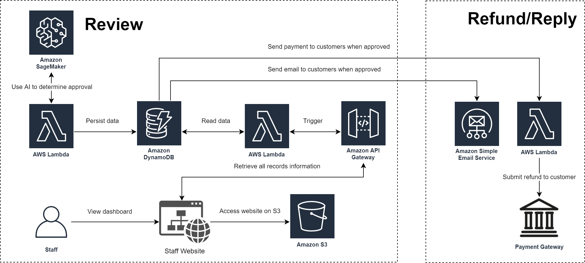
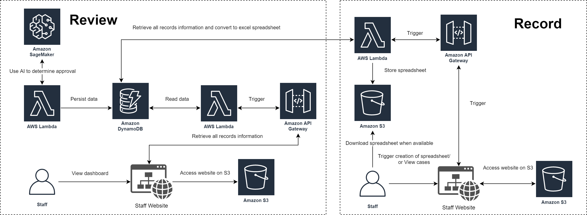

# Live Smart Hackathon (Ree-Cloud)

**Short Introduction**

> We are a team from Nanyang Polytechnic, consisting of Ryan Ho, Eugene Foo, Milton Sim and Elijah Chia, and we are excited to solve ACRA's pain points by leveraging on Amazon Web Service (AWS)'s technologies.

**Our Solution**
>  Our serverless solution encompasses around the usage of Optical Character Recognition (OCR) and Artifical Intelligence (AI) where we are able to automate the refunding of manual form requests for ACRA. Thus reducing time, effort and human errors. 

**Amazon Services Used**
- AWS Lambda
- Amazon API Gateway
- Amazon Augmented AI (Amazon A2I)
- Amazon DynamoDB
- Amazon S3
- Amazon SageMaker
- Amazon Textract

---

## OVERVIEW OF OUR ARCHITECTURE

 
 
 

**Request**

 

*Hard Copy Form*
- The customer submits the hard copy form to the ACRA staff
- The staff scans and uploads the document to the staff website where it will be stored in S3
- The uploading of the document to S3 will automatically trigger Lambda which will use Textract to extract the text elements from the document and stores this information in DynamoDB

*Online Form*
- The customer submits online form through the customer website which is hosted on S3
- The form details are stored in DynamoDB using API Gateway and Lambda

*Helpdesk and Chatbot*
- The customer can chat with the chatbot on the customer website which utilises Amazon Lex
- The customer can make enquiries to the helpdesk through Amazon Connect

**Review**

 

*Decision Making Engine*
- Once the form details are added to DynamoDB, Lambda is automatically triggered where it will make use of the SageMaker model to determine if the case should be approved.
- If SageMaker is unable to decide, the request will be sent to A2I. The staff is then able to help decide. This information will be used to retrain the model, making it smarter. 

*Dashboard*
- The staff views the staff website which is hosted on S3
- The website makes use of API Gateway and Lambda to retrieve the case records from DynamoDB

A case status can be 
1. Approved
2. Rejected
3. Pending Manual Review
4. Pending Manual Refund

**Refund/Reply**

 

*Customer Notification*
- When a case is approved or rejected, the customer will be notified via email using Lambda and Amazon SES

*Refund*
- When a case is approved, Lambda will be triggered and submits a refund to the customer through the Payment Gateway
- If the case requires manual refund, the staff has to manually refund the customer.

**Record**

 

*Excel Records*
- After from viewing the cases through a dashboard, the staff can request to view an Excel spreadsheet where the records will be retrieved using API Gateway and Lambda from DynamoDB. It will then be exported to S3 and be automatically downloaded to the staff's computer. The downloading of records is secured through a pre-signed URL

---

## Prerequisite

- All resources can be accessed in AWS Console

- For AI related training, it would be highly recommended for you to use AWS Sagemaker Studio. This is because it includes all the required imports

- Get familiar with Python programming in Jupyter Notebook and Lambda.

- Follow the diagrams provided

- But if all else fails you can contact us

### Setup

1. Clone this repository
2. Train a Sagemaker model using [Autopilot](https://aws.amazon.com/getting-started/hands-on/create-machine-learning-model-automatically-sagemaker-autopilot/) and deploy it
3. Create an [A2i](https://aws.amazon.com/blogs/machine-learning/object-detection-and-model-retraining-with-amazon-sagemaker-and-amazon-augmented-ai) human loop
5. Create a Lambda function for each [backend file](backend/)
    - Remember to include the DynamoDB table, A2i workflow ARN, S3 bucket location and Sagemaker endpoint in the python files
6. Deploy the Website Dashboard and File Upload pages into AWS S3

## Resources

[Lambda](backend/)

[Website Dashboard](frontend/dashboard.html)

[Website File Upload](frontend/upload_file.html)

[A2i Worker Task Template](frontend/a2i-worker-task-template.html)

[Training Data](project_resources/sagemaker-training-data.csv)
